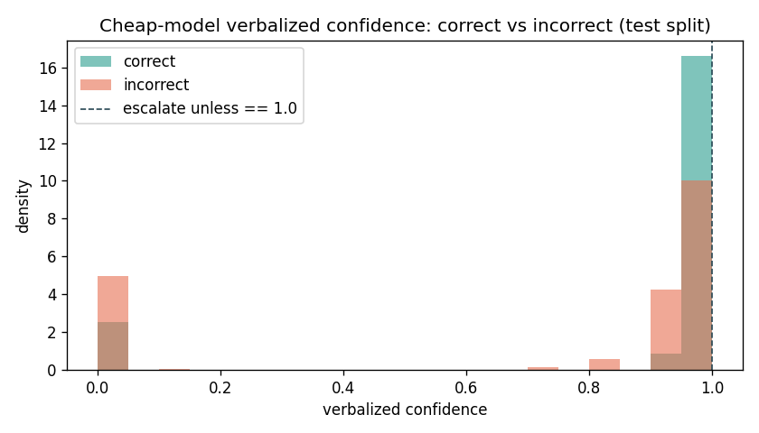

# Escalation-Signal Validation — sprint-7/phase-1

> Generated by `scripts/signal_validation.py`. Supporting evidence for ADR-0011.
> **No hard AUROC bar** — these numbers feed a human phase-2 go/no-go judgement call.

## Setup

- Cheap model: `gemini-2.5-flash-lite` (NO token logprobs — see ADR-0011).
- Questions: **500**; correct base rate: **23.2%**.
- Labels: same-run `failure_mode == "correct"` (confidence paired with its own answer).
- Split: seeded 80/20 test/calibration (seed=42); AUROC on the **test** split (n=400); threshold set on calibration only.

## AUROC — does the signal separate correct from incorrect? (test split)

AUROC 0.5 = no better than chance; higher = the signal is higher on correct answers.

| Signal                         | AUROC |
| ------------------------------ | ----- |
| verbalized confidence          | 0.667 |
| abstention (answered)          | 0.582 |
| retrieval RRF score            | 0.497 |
| hybrid (confidence OR abstain) | 0.685 |

## Operating point (illustrative)

The verbalized confidence is **bimodal at {0, 1}** — the cheap model is overconfident (among _answered_ questions its confidence is ~0.99 whether right or wrong), so a percentile threshold is degenerate. Operating-point procedure instead: **escalate unless the model is maximally confident (== 1.0) AND did not abstain.**

- Implied **escalation rate**: calibration 54.0%, **test 54.2%** (bounds the phase-2 cost estimate).

## Separation plot

## Reading

The numbers above are the deliverable; the phase-2 go/no-go is a human call (DEFINE
decision 2). A weak AUROC across all signals is itself a valid, honest finding: it
would mean cost-aware routing cannot beat a single model on this stack via these signals.
