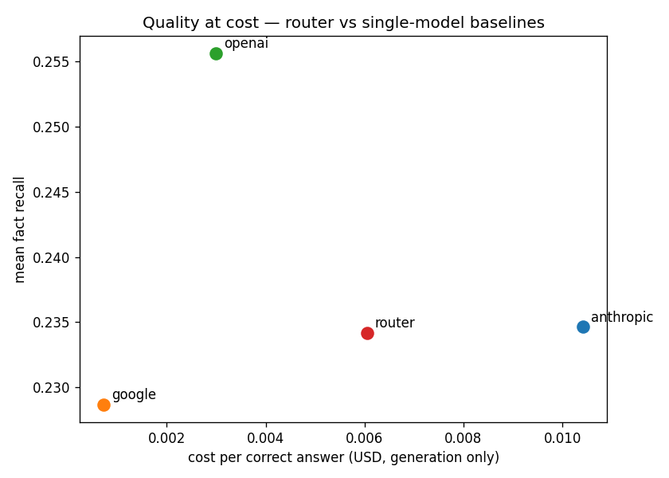

# Routing Verdict: Does Cost-Aware Escalation Pay Off?

> Generated from the sprint-7 combined sweep (`configs/routing-eval.yaml`):
> 500 questions × 4 systems, identical questions / retrieval / judge, one JSONL,
> $4.43 total. The head-to-head is produced by `scripts/routing_evaluation.py`.
> Supporting decisions: [ADR-0011](../adr/0011-escalation-signal.md) (escalation signal),
> [ADR-0012](../adr/0012-router-generator-composite.md) (router composite).

## 1. Hypothesis

Sprint 6 surfaced a finding: three RAG generators reach near-identical fact recall at
radically different cost and risk. The obvious next move is an **operational** one — answer
with the cheap model by default and **escalate to the strong model only when the cheap
answer looks untrustworthy**. If escalation is well-targeted, the system should inherit the
cheap model's price on easy questions and the strong model's quality on hard ones, beating
any single model on **cost per correct answer at equal quality**.

This sprint built that router (`RouterGenerator`, ADR-0012): cheap default
`gemini-2.5-flash-lite`, escalate to `claude-haiku-4-5` when the cheap model's **verbalized
confidence** is below maximal or it abstains (ADR-0011, `threshold: 1.0`). The hypothesis
under test:

> **The router beats the best single model on cost-per-correct at equal quality.**

The prior was not optimistic. ADR-0011 measured the only available inference-time signal as
**weak** (hybrid AUROC 0.685) and the implied escalation rate at **≈54%**. At that rate the
router pays the cheap model on every query _plus_ the strong model on more than half — so
ADR-0011 §6 named a **null result the expected, honest baseline**. The deliverable is the
measured verdict, not a win.

## 2. Evidence

All four systems answered the same 500 questions through the same retriever, scored by the
same judge, in one sweep. Cost-per-correct uses **generation cost only** (judge cost is eval
overhead, identical across systems); the denominator is `failure_mode == "correct"`.

| System                          | Cost / correct | Fact recall | Gen cost (500 q) | Correct |
| :------------------------------ | :------------: | :---------: | :--------------: | :-----: |
| `gemini-2.5-flash-lite` (cheap) |  **$0.0007**   |    22.9%    |      $0.074      |   101   |
| `gpt-5-nano-2025-08-07`         |  **$0.0030**   |  **25.6%**  |      $0.356      | **119** |
| **`router`** (cheap → strong)   |    $0.0061     |    23.4%    |      $0.714      |   118   |
| `claude-haiku-4-5` (strong)     |    $0.0104     |    23.4%    |      $1.230      |   118   |

Three readings:

- **The router lands between its own two halves, as designed.** At $0.0061/correct it sits
  between cheap Gemini ($0.0007) and strong Haiku ($0.0104) — the price blend of a
  ~50/50 escalation policy, not a free lunch.
- **The escalation rate is the one ADR-0011 predicted.** The router's strong-model spend
  (≈$0.640 = its $0.714 gen cost minus the $0.074 cheap-always floor) over Haiku's
  full-coverage cost ($1.230) implies **≈52% of queries escalated** — consistent with the
  calibrated ~54% in ADR-0011. Escalation is firing exactly as expected.
- **There is no quality dividend.** The router gets 118 correct (23.4% recall) — statistically
  level with Haiku (118 / 23.4%) and Gemini (101 / 22.9%). Routing did **not** buy the
  strong model's quality; it bought the strong model's _price_ on half the queries.

## 3. Verdict

**Routing does not pay off on this benchmark. The null result is confirmed — and is stronger
than "merely no improvement": the router is _strictly dominated_.**

- Gemini alone is **~9× cheaper** per correct answer at indistinguishable quality.
- GPT-5 Nano alone is **2× cheaper _and_ the highest quality** of the four (119 correct,
  25.6% recall).

So the cheapest-per-correct system _and_ the highest-quality system are both **single,
untuned models** — and neither is the router. Two compounding causes, both measured here:

1. **The signal is too weak to target escalation (ADR-0011, now confirmed at scale).** A
   0.685-AUROC confidence signal can't tell which cheap answers actually need the strong
   model, so escalating ~52% of queries spends on the strong model without reliably
   converting wrong answers to right ones. The cheap/strong price gap is eroded before it
   buys anything.
2. **The frontier is a model the router doesn't contain.** The router was built on the
   `gemini → haiku` axis. The harness shows that axis is the wrong one: `gpt-5-nano`
   dominates _both_ of the router's constituents on cost-per-correct **and** quality. When a
   single off-the-shelf model already sits on the Pareto frontier, the right operational
   decision is not to route — it is to **pick that model**.

This is a valid sprint result (SPRINT.md criterion 4). The point on display is not a clever
router; it is the **harness rendering a measured verdict on a plausible-sounding
architecture and rejecting it with numbers** — the same eval layer that scored the baselines
scored the router as "just another system," on identical questions, and showed it loses. A
vibes-based reading of the Sprint-6 finding ("the models cost differently, so route between
them") would have shipped the router. The measurement says: don't.



> **Note on absolute recall.** Fact recall sits at 23–26% across _all_ systems because it is
> gated by the shared retrieval substrate, not the generator choice. Since every system saw
> identical retrieval, this does not affect the head-to-head — it only means the verdict is
> about _relative_ cost-per-correct, which is exactly the routing question.

## 4. Reproduce

```bash
uv run rag-eval run --config configs/routing-eval.yaml --concurrency 8 --resume
make classify RESULTS_FILE=results/routing-eval.jsonl
uv run python scripts/routing_evaluation.py
```

The `--resume` flag lets an interrupted sweep continue without re-spending on completed
`(system, question_id)` rows; the analysis script asserts all four systems share the same
question set before computing the table (an unfair comparison cannot silently slip through).
